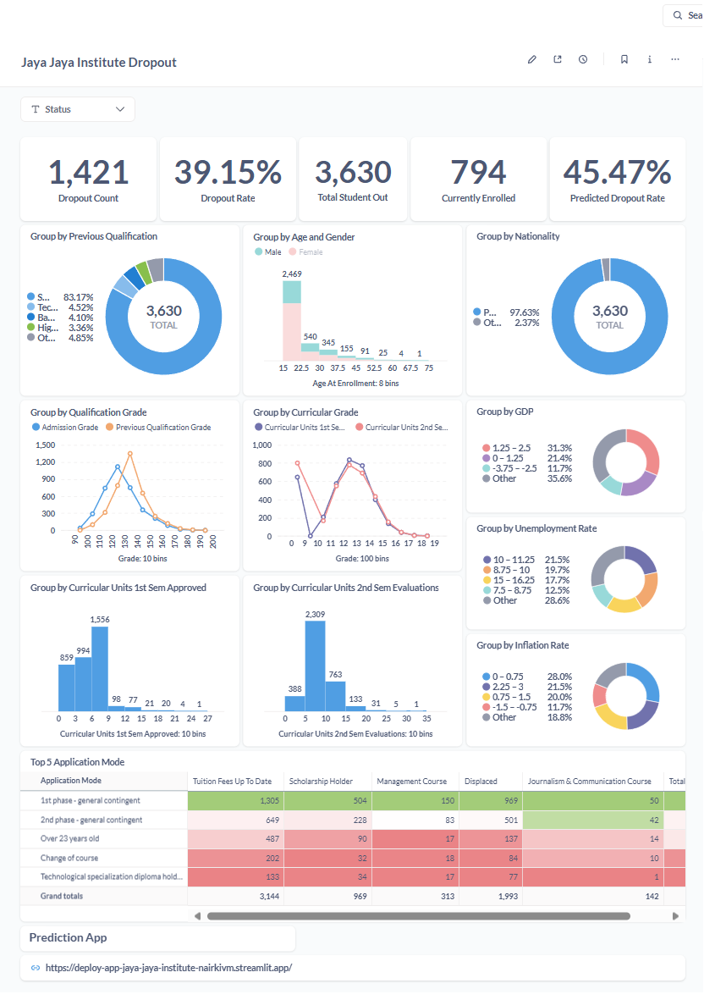
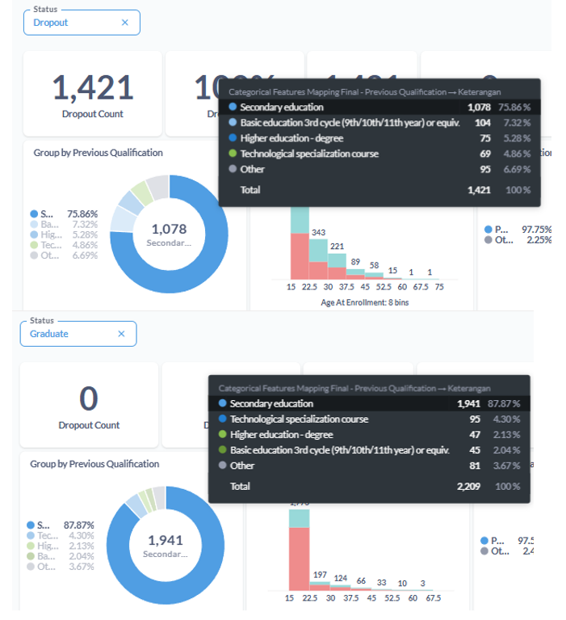
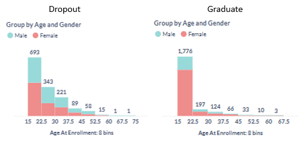
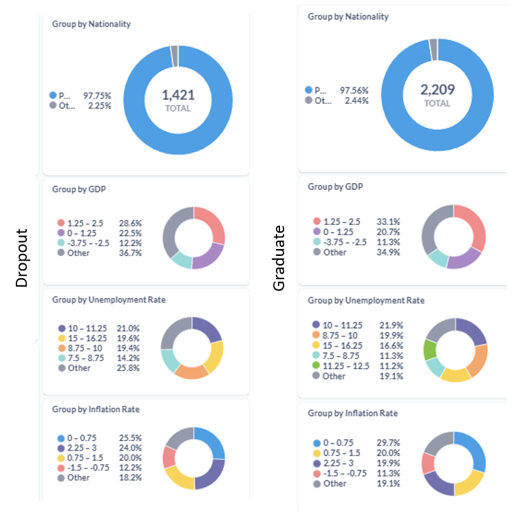
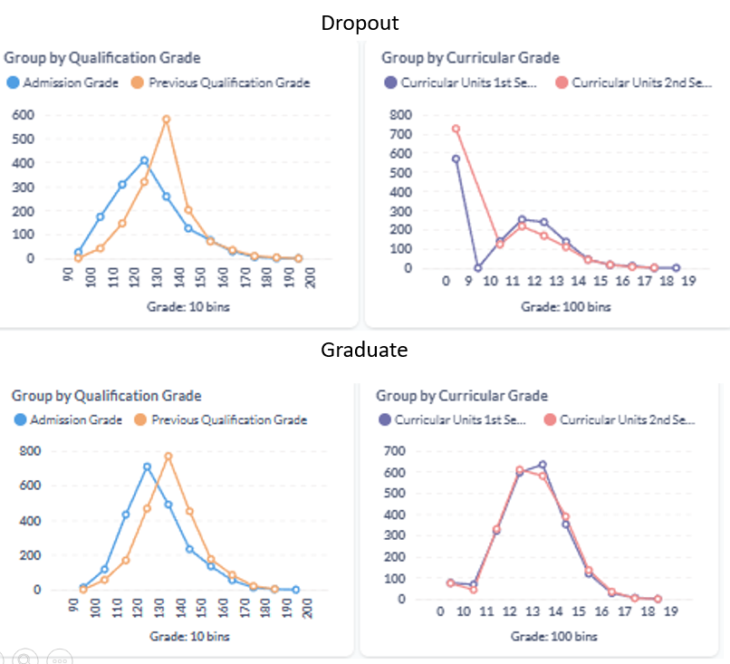
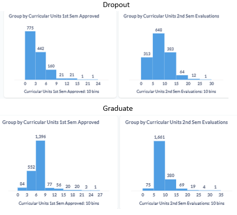
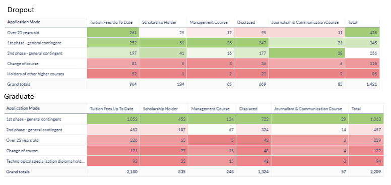

# Proyek Akhir: Menyelesaikan Permasalahan Perusahaan Edutech

## Business Understanding
Jaya Jaya Institut adalah institusi pendidikan yang telah berdiri sejak tahun 2000 dan memiliki reputasi baik dalam mencetak lulusan berkualitas. Namun, mereka menghadapi tantangan besar berupa tingginya angka siswa yang tidak menyelesaikan pendidikan alias dropout hingga hampir 40%. Masalah ini dapat berdampak negatif terhadap citra institusi serta efektivitas sistem pendidikan yang diterapkan.

### Permasalahan Bisnis
Permasalahan utama yang dihadapi Jaya Jaya Institut adalah
- Mengidentifikasi faktor apa saja yang mempengaruhi tingginya angka dropout
- Memperkirakan berapa angka dropout di masa depan untuk mahasiswa yang tengah menempuh pendidikan (*Enrolled*)
- Menyediakan apa saja solusi yang bisa ditawarkan untuk menekan angka dropout dengan berbasis data

### Cakupan Proyek
Proyek ini bertujuan untuk membantu Jaya Jaya Institut dalam mengatasi permasalahan dropout dengan pendekatan berbasis data. Cakupan proyek meliputi:
- Analisis dataset siswa untuk mengidentifikasi pola dan faktor yang berkontribusi terhadap dropout.
- Pembuatan model prediksi untuk mendeteksi siswa yang berisiko tinggi mengalami dropout.
- Pengembangan dashboard interaktif agar pihak institusi dapat dengan mudah memahami data dan memonitor performa siswa secara real-time.

### Persiapan

Sumber data: 

Realinho,Valentim, Vieira Martins,Mónica, Machado,Jorge, and Baptista,Luís. (2021). Predict students' dropout and academic success. UCI Machine Learning Repository. https://doi.org/10.24432/C5MC89. 

Setup environment:

```
python -m venv .venv

.venv\Scripts\activate

pip install -r requirements.txt
```

## Business Dashboard

> Akses Metabase
> 
> Email: mohfikri.aulyanor@gmail.com
> 
> Password: GJH577gt!



> Metabase ini dijalankan di *local environment*
> 
> Karena menggunakan database Postgres, maka tidak terdapat file ekspor dashboard `metabase.db.mv.db`
>
> Sebagai gantinya, data dashboard bisa di-*restore* menggunakan file `metabase_backup.sql`

File [`metabase_backup.sql`](./metabase_backup.sql)

<details>
    <summary><strong>Cara Me-restore Dashboard</strong></summary>
    
    1. Deploy Metabase dan Postgres baru dengan Docker dan taruh `metabase_backup.sql` di tempat menjalankan terminal (Referensi: https://www.dicoding.com/academies/590/tutorials/34128?from=34123)
    
    2. Jalankan perintah berikut: `docker exec -i postgres psql -U [pg_user] -d [metabase_db] < metabase_backup.sql`
</details>


### Keterangan Dashboard

Dashboard ini merupakan hasil akhir dari proyek analitik prediktif untuk memahami dan mengantisipasi tingginya tingkat dropout di Jaya Jaya Institut. Berdasarkan data yang dianalisis, perusahaan memiliki total 3.630 mahasiswa yang sudah keluar, dengan dropout rate aktual sebesar 39,15%, atau setara dengan 1.421 orang yang telah dropout dalam periode yang dianalisis.

Sementara itu, dari sisi pemodelan prediktif, sistem memperkirakan dropout rate sebesar 45,47% pada 794 mahasiswa yang masih di bangku kuliah (*enrolled*) berdasarkan model machine learning menggunakan XGBoost dengan performa yang cukup baik (akurasi 92,56%, presisi 93,13%, recall 95,84%, dan F1-score 94,47%). Prediction app bisa diakses dalam link [berikut](https://deploy-app-jaya-jaya-institute-nairkivm.streamlit.app/) dan keterangan lebih lengkap bisa dilihat [di sini](./app/README.md).

Lebih lanjut, analisis dilakukan secara mendalam berdasarkan faktor-faktor terpenting (berdasarkan [prediksi model](./feature_importance.csv)) berikut.

1. Berdasarkan *Previous Qualification*



Baik mahasiswa yang "dropout" maupun yang "graduate", keduanya didominasi oleh "Secondary education" dengan persentase berturut-turut 75,86% dan 87,87%. Dengan kata lain, ditemukan lebih sedikit proporsi mahasiswa yang dropout dengan "Secondary education". Selain itu, tidak ada perbedaan signifikan pada kualifikasi tersebut.

2. Berdasarkan *Age and Gender*



Mahasiswa perempuan lebih mendominasi kelompok *graduate*, terutama pada usia 15–22,5 tahun (77,87%), sementara pada kelompok *dropout* proporsi pria dan wanita lebih seimbang (sekitar 50:50 di semua rentang usia).

3. Berdasarkan Daerah Asal (*Nationality, (Regional) GDP, (Regional) Unemployment Rate, dan (Regional) Inflation Rate*)



Secara makro, tidak tampak perbedaan signifikan berdasarkan nationality, GDP regional, tingkat pengangguran, atau inflasi. Namun, bisa jadi terdapat kombinasi variabel mikro yang relevan.

4. Berdasarkan Nilai (*Grade*)



Nilai pada semester 1 dan 2 (curricular grade) menjadi indikator yang cukup kuat: banyak mahasiswa *dropout* memiliki nilai sangat rendah (0–9). Sementara *admission grade* dan *previous qualification grade* tidak menunjukkan perbedaan signifikan.

5. Berdasarkan Jumlah *Curricular Units*



Mahasiswa yang *dropout* cenderung mengambil lebih sedikit *curricular units* pada semester awal, baik yang berhasil disetujui (*approved*) pada semester 1 maupun yang dievaluasi (*evaluated*) pada semester 2.

6. Berdasarkan Faktor Lain



Mahasiswa *dropout* lebih banyak berasal dari jalur *Over 23 years old*, sedangkan mahasiswa *graduate* dominan dari jalur *1st phase general contingent*. Kombinasi variabel seperti status pembayaran (*Tuition Fee Up to Date*), kepemilikan beasiswa, status *Displaced*, serta jenis jurusan juga membentuk pola tertentu.

## Menjalankan Sistem Machine Learning

Untuk menjalankan sistem prediksi, ikuti panduan [berikut](./app/README.md). rediction app dapat langsung diakses melalui [link ini](https://deploy-app-jaya-jaya-institute-nairkivm.streamlit.app/).


## Conclusion
Berdasarkan hasil analisis data dan pemodelan machine learning, ditemukan bahwa angka *dropout* mahasiswa di Jaya Jaya Institut mencapai angka yang cukup tinggi, yaitu 39,15% dari total mahasiswa yang sudah keluar kampus. 

Faktor-faktor utama yang memengaruhi risiko *dropout* meliputi kualifikasi pendidikan sebelumnya, usia dan jenis kelamin, nilai akademik awal (terutama pada semester 1 dan 2), jumlah curricular units yang diambil, serta kondisi daerah asal seperti status pembayaran uang kuliah dan kepemilikan beasiswa. Meskipun variabel ekonomi makro seperti GDP regional atau tingkat pengangguran tidak menunjukkan pola signifikan secara langsung, kombinasi variabel mikro tetap berpotensi besar dalam menjelaskan pola dropout.

Model prediktif yang dikembangkan menggunakan algoritma XGBoost berhasil mencapai performa yang sangat baik dengan akurasi 92,56%, F1-score 94,47%, serta recall yang tinggi (95,84%), yang menunjukkan kemampuan model dalam mendeteksi mahasiswa yang berisiko dropout secara andal. Berdasarkan model tersebut, diprediksi sekitar 45,47% dari 794 mahasiswa yang masih di bangku kuliah (*enrolled*) berpotensi *dropout*.

### Rekomendasi Action Items
Berdasarkan temuan proyek ini, berikut beberapa langkah yang direkomendasikan bagi pihak manajemen Jaya Jaya Institut:

- Intervensi Dini Berdasarkan Faktor Risiko Utama

Fokuskan program pembinaan pada mahasiswa dengan nilai semester awal rendah, status administrasi yang tidak lengkap (misalnya tunggakan biaya kuliah), serta mereka yang masuk melalui jalur seleksi non-umum seperti *Over 23 years old*.

- Optimalisasi Dukungan Akademik dan Finansial

Pertimbangkan pemberian beasiswa atau bantuan akademik (seperti tutor atau kelas remedial) bagi mahasiswa dengan profil risiko tinggi berdasarkan variabel yang telah dianalisis.

- Penguatan Data Akademik dan Administratif

Tingkatkan kualitas pelaporan dan integrasi data untuk memastikan bahwa semua variabel penting (nilai, unit kuliah, status beasiswa, dll.) tersedia dan terkini, demi menjaga keandalan sistem prediksi.

- Penerapan Dashboard Monitoring Real-Time

Gunakan dashboard interaktif yang telah dibuat sebagai alat bantu monitoring dan evaluasi performa akademik mahasiswa secara real-time oleh pihak manajemen dan dosen wali.

- Implementasi Sistem Monitoring Risiko Dropout Berbasis Model Prediktif

Gunakan model yang telah dikembangkan untuk secara berkala mengidentifikasi mahasiswa *enrolled* yang berisiko tinggi mengalami dropout, sehingga intervensi bisa dilakukan sejak dini.